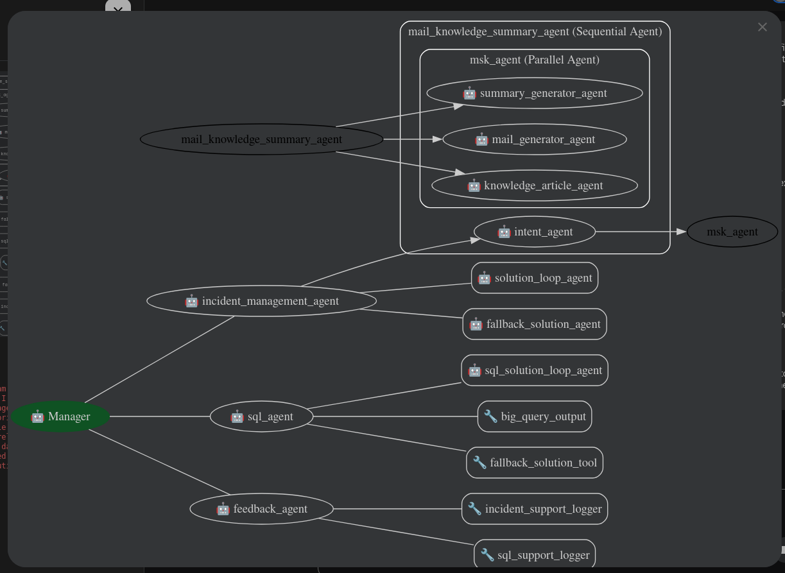

# Manager-Orchestrated Multi-Agent System

### Incident Resolution & Text-to-SQL with Iterative Validation

This project implements a sophisticated multi-agent orchestration layer designed to bridge the gap between "Stochastic LLM outputs" and "Deterministic Enterprise Requirements." By utilizing a **Manager-Worker architecture**, the system intelligently routes queries, self-corrects through iterative validation loops, and maintains a strict Human-in-the-Loop (HILT) protocol.

## 🌟 Behind the Design Scenes

Standard RAG systems often fail when the initial retrieval is insufficient or when the LLM hallucinates a solution. This architecture solves that through four key innovations:

1.  **Intent-Driven Orchestration:** A central Manager Agent ensures a clean separation of concerns between **Incident Management** (unstructured knowledge) and **SQL Analytics** (structured data), preventing prompt-bleed and reducing latency.
2.  **Iterative "Self-Healing" Loops:** Instead of giving up on low-confidence results, the `solution_loop_agent` enters a 3-stage validation cycle. With each iteration, it dynamically expands its semantic search scope (+2 results), effectively "digging deeper" until a validator confirms the solution meets the quality threshold.
3.  **Human-in-the-Loop (HILT) Guardrails:** We acknowledge that LLMs are co-pilots, not pilots. The system forces a decision point where a human can trigger a "Re-run with clarification" or a "Fallback," ensuring no incorrect solution is ever finalized without oversight.
4.  **Privacy-First SQL execution:** A critical enterprise guardrail—the SQL agent generates queries based on **metadata only**. The raw database rows are returned directly to the user interface, ensuring sensitive data never enters the LLM's context window.

## 🏗️ Architecture Overview



### Key Components
*   **Orchestrator:** Google Gemini-2.5-Flash for high-speed reasoning.
*   **Vector Store:** ChromaDB (Multi-collection: `incident_corpus` & `table_metadata`).
*   **Embedding Model:** `text-embedding-005` for state-of-the-art semantic retrieval.
*   **Data Warehouse:** Google BigQuery.
*   **Sequential Post-Processing:** Automated creation of Knowledge Articles and Email Summaries via parallel sub-agents.

---

Prerequisites:
*   **Environment Variables:** I have used IAM based credentials with the service account created and to setup that the .env file should look like this:
```
GOOGLE_GENAI_USE_VERTEXAI="True"
GOOGLE_CLOUD_PROJECT="<project-name>"
GOOGLE_CLOUD_LOCATION="<location>"
```

Setup the os environment in SharedResources/load_environment.py
*NOTE*- This file should be placed along with agent.py file, even in sub agents. Also it is needed to setup the client which calls the llm, present in SharedResouces/load_environment.py
*   **Installation:** Used google-adk and adhered to standard folder structure as per google ADK's document (this project uses ADC auth for calling models, read the documentation for api bases access)
**Frontend tech Stack**: React + tailwindcss + Vite
**Backend Tech Stack**: FastAPI + Uvicorn + google-adk

*Inspired by the work which solely i did and learned in my company.*
